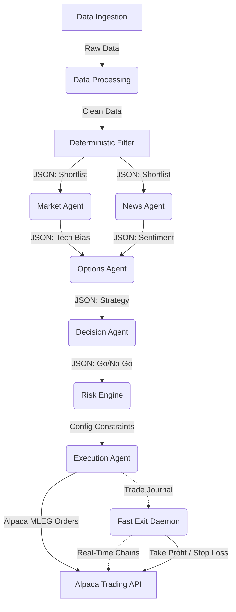

# Autonomous AI Options Trading Terminal: Comprehensive Technical Report

## 1. Abstract
The Autonomous AI Options Trading Terminal is an advanced, fully automated, multi-agent algorithmic trading system. Built on top of the Alpaca Trading API, the system eliminates human discretionary bias by employing a sequentially structured pipeline of Large Language Model (LLM) agents powered by DeepSeek-V4-Flash via Featherless AI. The architecture handles end-to-end trading operations: from universe screening and macroeconomic sentiment analysis, to complex multi-leg options strategy formulation, strict deterministic risk-management, automated execution, and continuous real-time portfolio monitoring for automated exits.

## 2. Architecture Overview
The system is built on a highly modular, decoupled architecture consisting of three primary layers:
1. **The State-Driven AI Pipeline**: A sequential series of Python-based AI agents.
2. **The Execution & Monitoring Daemons**: Background processes handling live API interactions.
3. **The Presentation Layer**: A FastAPI bridge serving a real-time Next.js React dashboard.

### 2.1 Decoupled State Management (JSON-driven)
Unlike monolithic trading bots that hold state in memory, this system utilizes a file-based state machine. Each agent in the pipeline acts as an isolated microservice. An agent reads the output of the preceding agent from a localized JSON file in the `SAVE-DATA-PER-AGENT/` directory, processes it, and writes its own output to a new JSON file. 
This decoupled design provides massive technical benefits:
- **Crash Resilience**: If the pipeline is interrupted or an API rate limit is hit, execution can resume exactly where it left off without losing historical context.
- **Auditability**: Every decision, from the LLM's raw reasoning to the final calculated Option Clearing Corporation (OCC) symbol, is permanently logged and easily queryable by the frontend UI.
- **Asynchronous Execution**: The UI does not need to wait for the LLM to finish; it simply polls the JSON directory for updates.

### 2.2 System Workflow Diagram

## 3. The Multi-Agent Pipeline
The core intelligence of the system is driven by `Run_Pipeline.py`, which sequences the agents in a strict chronological order.

### 3.1 The Deterministic Filter (Quantitative Analysis)
Before invoking expensive and time-consuming LLM calls, the system runs a deterministic Python script to narrow down the universe of tradable equities (e.g., S&P 500 components). It calculates technical indicators using historical market data:
- **Momentum & Trend**: Moving Average crossovers (e.g., 20-day vs. 50-day SMA).
- **Volume**: Identifies unusual options or equity volume spikes to gauge institutional interest.
The output is a highly curated shortlist of 5-10 actionable tickers, complete with mathematical scores, which are passed downstream.

### 3.2 Market Agent (Macro/Micro Technical Synthesis)
The Market Agent acts as the technical analyst. It consumes the quantitative data from the Deterministic Filter and uses the LLM to synthesize a qualitative market view. It analyzes the broader market context and the specific equity's technical structure to generate a distinct directional bias (Bullish, Bearish, or Neutral) and assigns an `ai_confidence` score from 0.0 to 1.0.

### 3.3 News Agent (Sentiment Analysis & NLP)
Running in parallel or immediately after the Market Agent, the News Agent acts as the fundamental analyst. It fetches the latest headlines for the shortlisted tickers via news APIs. 
**Technical Highlight: Resilience Engine**: Because LLMs can occasionally hallucinate JSON structures, the News Agent is wrapped in a 3-retry resilience loop. If the LLM returns malformed JSON or markdown-wrapped strings, the agent programmatically strips the markdown blockticks and validates the schema. It scores the sentiment on a numerical scale, outputting structured data that can be programmatically interpreted by the next stage.

### 3.4 Options Agent (Strategy Formulation)
The Options Agent is the most technically complex LLM node. Given the directional bias (e.g., Bullish) and the current underlying price, it parses live option chains to construct a targeted derivative strategy.
- **Strategy Selection**: Depending on volatility and confidence, it selects from Long Calls, Long Puts, Bull Call Spreads, or Bull Put (Credit) Spreads.
- **Symbology & Pricing**: It mathematically calculates the required strike prices, selects an expiration date (DTE), and formats the legs into strict OCC symbology (e.g., `AAPL260116C00150000`).
- **Greeks & Profitability**: It calculates theoretical Max Loss, Max Profit, and Breakeven points for the proposed strategy.

### 3.5 Decision Agent (The Consensus Engine)
The Decision Agent acts as the Portfolio Manager. It aggregates the outputs from the Market, News, and Options agents. It evaluates conflicting data (e.g., Bullish technicals but Bearish news sentiment) and makes a final, binary Go/No-Go decision (`PASS` or `REJECT`) for each ticker, providing a detailed reasoning paragraph for its conclusion.

## 4. Risk Assessment Engine
To protect the portfolio from LLM hallucinations or over-leveraging, the approved strategies are passed to the **Risk Engine**. This is a purely deterministic, non-AI Python script.
It reads the user's hardcoded parameters from `config.json` and evaluates:
- **Account Constraints**: Fetches live buying power and equity from Alpaca.
- **Max Exposure**: Ensures the total capital at risk for the proposed trade does not exceed the allowed percentage of total equity (e.g., 20%).
- **Daily Loss Limits**: Calculates if the account has already hit its maximum drawdown threshold for the trading session.
- **Position Sizing**: Dynamically adjusts the number of contracts to trade based on the max risk allowed per trade.
If any constraint is violated, the trade is rejected and marked with a `binding_constraint` (e.g., `INSUFFICIENT_BUYING_POWER`).

## 5. Execution Agent
Trades that survive the Risk Engine are handed to the Execution Agent. This module interfaces directly with the Alpaca Trading API via the `alpaca-py` SDK.
- **Multi-Leg (MLEG) Routing**: For complex strategies like spreads, the agent constructs an `OrderClass.MLEG` request. This is critical: it guarantees that both legs (the long and the short) are routed to the exchange atomically, eliminating execution leg-risk.
- **Limit Pricing**: It calculates the net debit or net credit based on the bid/ask spreads provided by the Options Agent and submits a strict `LimitOrderRequest` to avoid slippage.
- **Trade Journaling**: Upon a successful `SUBMITTED` response from Alpaca, the order ID, entry timestamps, and exact legs are serialized into `trade_journal.json`. 

## 6. Continuous Monitoring & Fast Exit Daemon
Execution is only the beginning of the trade lifecycle. To manage open positions, the system employs the `fast_exit_daemon.py`.
- **Subprocess Architecture**: The daemon is spawned as a detached subprocess by the API server upon startup. It runs in an infinite `while True` loop, waking up every 30 seconds.
- **Real-Time P&L Calculation**: The daemon fetches the latest options chain pricing for all `OPEN` legs in the `trade_journal.json`. It meticulously handles the sign conventions of Alpaca fills—normalizing single-leg fill prices against multi-leg net-credit fill prices using absolute value conversions (`abs(filled_price) * 100`).
- **Automated Exits**: It evaluates the real-time return percentage against the user's configuration. If a trade hits the `take_profit_pct` (e.g., +50%), drops below the `stop_loss_pct` (e.g., -25%), or approaches the `max_dte` limit, the daemon constructs a closing order (`SELL_TO_CLOSE` or `BUY_TO_CLOSE`) and executes it immediately.
- **State Reconciliation**: If a position is manually closed by the user in the Alpaca web dashboard, the daemon detects the discrepancy between the portfolio and the journal, automatically marking the ghost position as `CLOSED` to maintain state integrity.

## 7. Presentation Layer & Integration
The system provides full transparency to the user via a modern web interface.
- **FastAPI Backend (`api_server.py`)**: Acts as the middleware. It exposes RESTful endpoints (`/api/dashboard`, `/api/pipeline/latest`) that stitch together the static JSON state files with live, dynamic portfolio data fetched from Alpaca.
- **Next.js Frontend**: A responsive, Tailwind-styled React application. 
  - The **Dashboard** provides real-time telemetry on account equity, risk utilization capacity, and active positions. 
  - The **Pipeline Explorer** visually maps the JSON state into an interactive Stepper UI, allowing the user to click through every stage of the AI's reasoning process in real-time as the background scripts run.
- **Unified Bootstrapper**: The entire tech stack—FastAPI, Next.js, and the background Exit Daemon—is launched via a single `start_server.py` script, which automatically injects virtual environment paths and manages subprocess lifecycles.

## 8. Conclusion
By decoupling the heavy analytical lifting of Large Language Models from the strict, deterministic logic required for risk management and execution, the Autonomous AI Options Trading Terminal achieves a highly resilient, scalable, and professional-grade architecture. The system successfully bridges the gap between qualitative AI market analysis and quantitative API execution.
